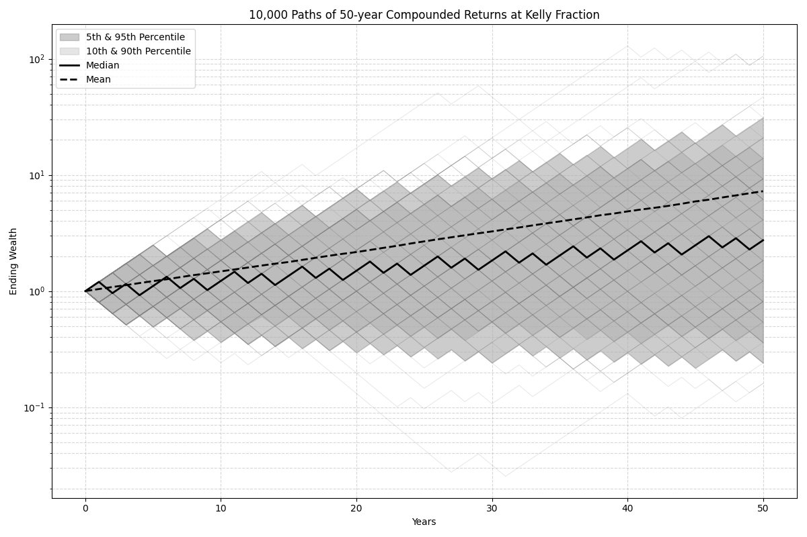

# Kelly Simulation Documentation

This project explores the Kelly criterion for optimal bet sizing in repeated betting scenarios. The main simulation code is in `kelly_simulation.py`.

## What does `kelly_simulation.py` do?

- **Simulates single and double bet scenarios** using the Kelly criterion.
- **Analyzes the relationship between betting fraction and long-term growth** (logarithmic growth rate).
- **Simulates and visualizes bankroll trajectories** over time for both single and double bet cases.
- **Saves all generated plots to the `/images` directory** for easy review and documentation.

## Generated Plots

The following images are produced by running the simulations:

### 1. Single Bet: Growth Rate vs. Betting Fraction
- **File:** `images/single_bet_growth_rate.png`
- **Description:** Shows how the log growth rate changes as you vary the betting fraction. The Kelly fraction is marked with a red dashed line.


### 2. Double Bet: Growth Rate Contour
- **File:** `images/double_bet_growth_rate_contour.png`
- **Description:** Contour plot showing the log growth rate for two independent bets as you vary both betting fractions. The Kelly-optimal point is marked in red.


### 3. Single Bet: Bankroll Trajectories
- **File:** `images/single_bet_trajectories.png`
- **Description:** Shows many simulated paths of bankroll growth over time at the Kelly fraction. Includes percentile bands, median, and mean.



### 4. Double Bet: Bankroll Trajectories
- **File:** `images/double_bet_trajectories.png`
- **Description:** Shows simulated paths of bankroll growth over time for two independent bets at their Kelly fractions, with percentile bands, median, and mean.


---

These visualizations help you understand:
- Why the Kelly fraction is optimal for long-term growth
- The risk and variability of different bet sizes
- The distribution of possible outcomes over time

For more details, see the code and comments in `kelly_simulation.py`.

## How to Run

To run the simulation and generate all plots, execute:

```bash
python kelly/kelly_simulation.py
```
